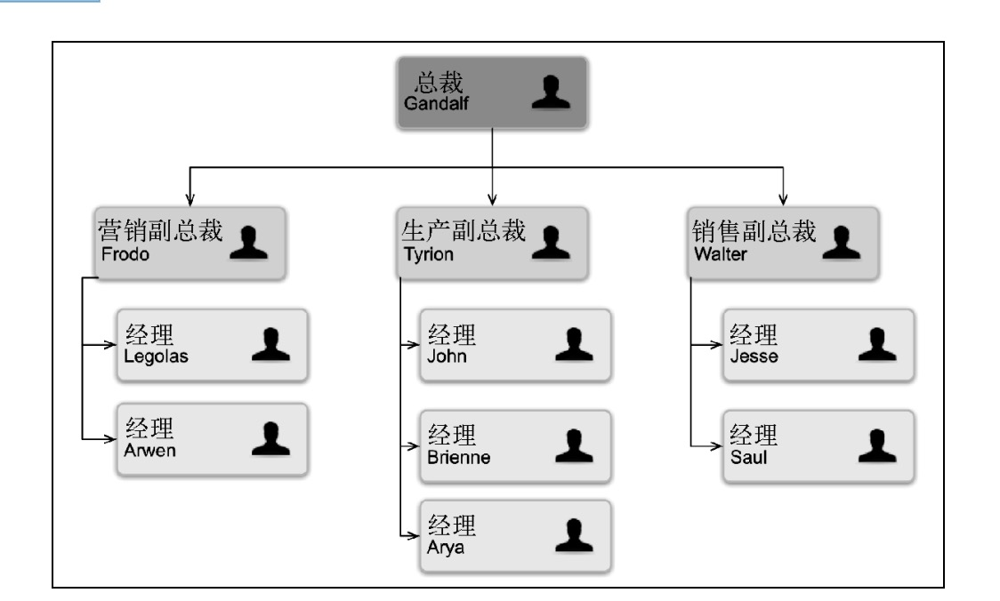
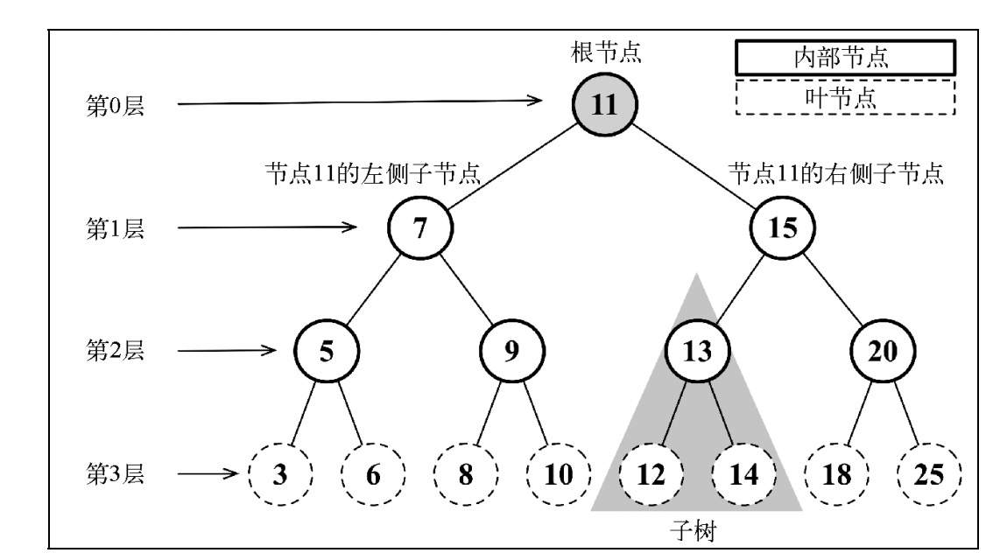

# 树
我们将要学习另一种非顺序数据结构——树，它对于存储需要快速查找的数据非常有用。

## 树数据结构
树是一种分层数据的抽象模型。现实生活中最常见的树的例子是家谱，或是公司的组织架构
图，如下图所示。

 

## 树的相关术语
一个树结构包含一系列存在父子关系的节点。每个节点都有一个父节点（除了顶部的第一个
节点）以及零个或多个子节点：

 

位于树顶部的节点叫作根节点（11）。它没有父节点。树中的每个元素都叫作节点，节点分
为内部节点和外部节点。至少有一个子节点的节点称为内部节点（7、5、9、15、13 和 20 是内部
节点）。没有子元素的节点称为外部节点或叶节点（3、6、8、10、12、14、18 和 25 是叶节点）。
一个节点可以有祖先和后代。一个节点（除了根节点）的祖先包括父节点、祖父节点、曾祖
父节点等。一个节点的后代包括子节点、孙子节点、曾孙节点等。例如，节点 5 的祖先有节点 7
和节点 11，后代有节点 3 和节点 6。
有关树的另一个术语是子树。子树由节点和它的后代构成。例如，节点 13、12 和 14 构成了
上图中树的一棵子树。
节点的一个属性是深度，节点的深度取决于它的祖先节点的数量。比如，节点 3 有 3 个祖先
节点（5、7 和 11），它的深度为 3。
树的高度取决于所有节点深度的最大值。一棵树也可以被分解成层级。根节点在第 0 层，它
的子节点在第 1 层，以此类推。上图中的树的高度为 3（最大高度已在图中表示——第 3 层）。
现在我们知道了与树相关的一些最重要的概念，下面来学习更多有关树的知识。

## 二叉树和二叉搜索树
二叉树中的节点最多只能有两个子节点：一个是左侧子节点，另一个是右侧子节点。这个定义有助于我们写出更高效地在树中插入、查找和删除节点的算法。二叉树在计算机科学中的应用
非常广泛。
二叉搜索树（BST）是二叉树的一种，但是只允许你在左侧节点存储（比父节点）小的值，
在右侧节点存储（比父节点）大的值。上一节的图中就展现了一棵二叉搜索树。
二叉搜索树将是我们要在本章研究的数据结构。